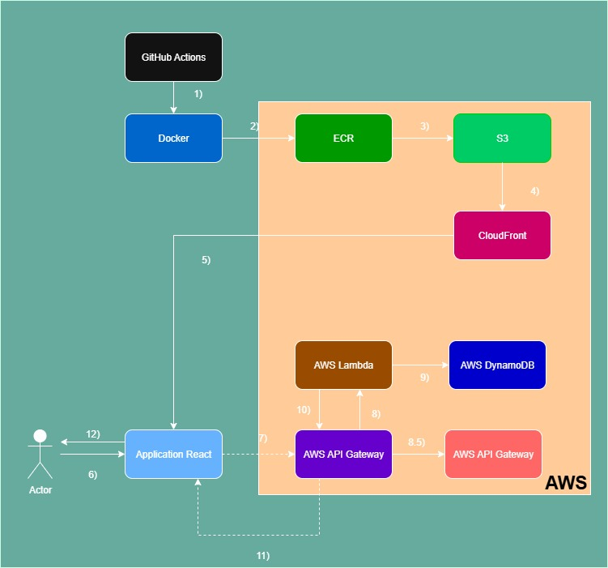

# ProjetFilRouge 🪢

> **⚠️ Important !**
> Avant de lancer la pipeline CD, vérifiez que la resource API Gateway est bien supprimée sur AWS. Si ce n'est pas le cas assurez vous de la supprimer manuellement avant de relancer la pipeline, autrement vous aurez une erreur au moment de l'import des ressources existantes à cause d'un problème que je ne suis pas parvenu à règler.

## Table des matières 📖

* [Introduction](#introduction)
* [Architecture globale](#architecture-globale)
* [Fonctionnalités](#fonctionnalités)
* [Microservices](#microservices)
* [Déploiement](#déploiement)
* [Sécurité](#sécurité)
* [Conclusion](#conclusion)

## Introduction 📝
------------

ProjetFilRouge est une application web de gestion de tâches (todos) qui utilise une architecture microservices pour offrir une expérience utilisateur fluide et évolutive. L'application est construite à l'aide des technologies suivantes : React, Node.js, AWS Lambda, AWS API Gateway, AWS DynamoDB et Docker.

## Architecture globale 🏗️
---------------------

L'architecture de ProjetFilRouge est composée de plusieurs microservices qui communiquent entre eux pour offrir les fonctionnalités de l'application. Les microservices sont les suivants :

* Frontend (React App) : responsable de l'interface utilisateur et de la logique métier
* Backend (AWS Lambda) : responsable de la logique métier et de l'intégration avec la base de données
* Base de données (AWS DynamoDB) : responsable du stockage des données
* ECR (Amazon Elastic Container Registry) : responsable du stockage des images Docker
* S3 (Amazon Simple Storage Service) : responsable du stockage des fichiers statiques de l'application
* CloudFront (Amazon CloudFront) : responsable de la mise en cache et de la distribution des fichiers statiques de l'application via un réseau de serveurs distribués dans le monde entier
* API Gateway (AWS API Gateway) : responsable de la gestion des requêtes et des réponses entre le frontend et le backend
* Lambda (AWS Lambda) : responsable de l'exécution de la logique métier de l'application en réponse aux requêtes envoyées par l'API Gateway. La Lambda est déclenchée par les événements de l'API Gateway et retournent les réponses à l'application frontend.
* CloudWatch (AWS CloudWatch) : responsable de la journalisation et de la surveillance des logs de l'application
* Pipelines CI/CD (GitHub Actions) : responsables de la construction et du déploiement de l'application sur AWS. Les pipelines CI/CD sont déclenchés par chaque push sur le repository GitHub. Ils s'assurent que le code est correctement compilé et déployé sur AWS.
## Fonctionnalités 🧱
--------------

ProjetFilRouge offre les fonctionnalités suivantes :

* Création de tâches (todos)
* Modification de tâches
* Suppression de tâches
* Affichage de la liste des tâches
* Recherche de tâches par titre ou description

## Microservices 🌐
--------------

### Frontend (React App) ⚛️

Le frontend est responsable de l'interface utilisateur et de la logique métier. Il est construit à l'aide de React et communique avec le backend via des calls API pour les différentes requêtes (POST, PUT, GET et DELETE)

### Backend (AWS Lambda + Node.js) λ

Le backend est responsable de la logique métier et de l'intégration avec la base de données. Il est construit à l'aide de Node.js et utilise AWS SDK pour l'intégration avec la base de données.

Le backend reçoit les requêtes de l'API Gateway et les traite en fonction de la logique métier.

### Base de données (AWS DynamoDB) 🛢️

La base de données est responsable du stockage des données. Elle est construite à l'aide de AWS DynamoDB et utilise la table Todos pour stocker les tâches (todos)

### API Gateway (AWS API Gateway) 🌉

L'API Gateway est responsable de la gestion des requêtes et des réponses entre le frontend et le backend. Il utilise les méthodes suivantes :

* GET : pour récupérer les données
* POST : pour créer des données
* PUT : pour modifier des données
* DELETE : pour supprimer des données
* OPTIONS : pour le CORS

## Déploiement 🦅
-------------

L'application est déployée sur AWS à l'aide de Docker, de GitHub Actions qui va utiliser les fichiers Terraform. Les étapes de déploiement sont les suivantes :

1. Construction des images Docker (une pour le frontend & une pour le backend)
2. Déploiement des images Docker sur AWS ECR
3. Déploiement du bucket S3
4. Déploiement de l'application sur AWS Lambda
5. Configuration de l'API Gateway et de la Lambda
6. Configuration des logs CloudWatch

## Diagramme de l'architecture du projet 🛠️ : 
----------

Légende : 

1) Lancemement des pipelines CI et CD par GitHub Actions
2) Build & Push des images frontend et backend vers ECR par Docker
3) Création/Import du bucket S3
4) Déploiement du frontend sur CloudFront
5) Envoi du frontend déployé vers l'application React en ligne hébergée
6) Action de l'utilisateur (POST, PUT ou DELETE)
7) Call API vers API Gateway
8) Envoie de la requête vers la fonction Lambda
8.5) Ecriture des logs de API Gateway dans CloudWatch
9) Traitement de la requête par la fonction Lambda, puis communication avec la base de données DynamoDB
10) Envoie de la réponse à la requête vers API Gateway
11) Envoie de la réponse à la requête vers l'application React
12) Affichage des données mises à jour pour l'utilisateur

## Conclusion 📗
----------

ProjetFilRouge est une application web de gestion de tâches (todos) qui utilise une architecture microservices pour offrir une expérience utilisateur fluide et évolutive. L'application est construite à l'aide de React, Node.js, AWS Lambda, AWS API Gateway, AWS DynamoDB, Docker, Terraform, GitHub Actions, ECR, S3, CloudFront et CloudWatch. Les microservices communiquent entre eux pour offrir les fonctionnalités de l'application. L'application est déployée sur AWS à l'aide de Docker et de GitHub Actions. Les mesures de sécurité sont mises en place